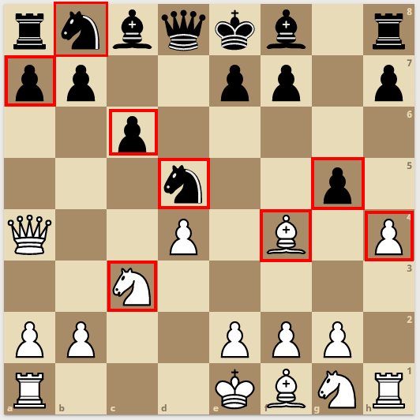
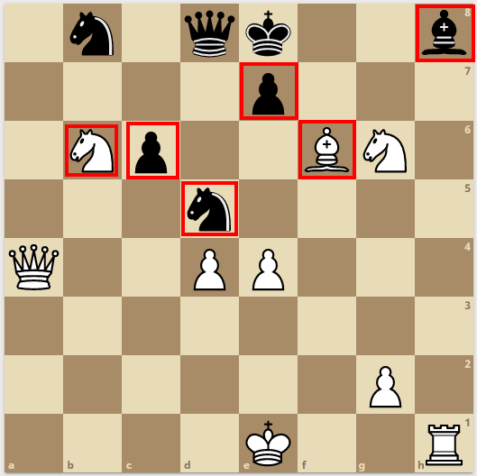
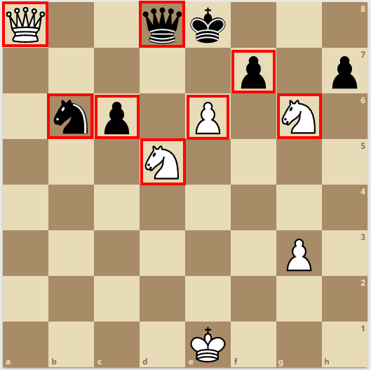

# Chess Score Calculator

- [Problem statement](#problem-statement)
- [Score calculation](#score-calculation)
- [Examples](#examples)
  - [Example 1](#example-1)
  - [Example 2](#example-2)
  - [Example 3](#example-3)
- [Building from source](#building-from-source)

## Problem statement

Calculate instantenous score status of both whites and blacks in a chessboard.
See the [score calculation method](#score-calculation).

**Input:** A file that contains the current chessboard layout.

The file contains the information of which chess piece is in each tile.
<br>
Each tile is represented by two characters.
<br>
The first character is the abbreviation of the chess piece.
(See the table in [score calculation](#score-calculation).)
<br>
The second character denotes which side the piece belongs to.
(`b` (beyaz) for whites, `s` (siyah) for blacks)
<br>
In case the tile is empty, it is denoted by `--` characters.

**Example input:**

`board1.txt`
```
ks as fs vs ss fs -- ks
ps ps -- -- ps ps -- ps
-- -- ps -- -- -- -- --
-- -- -- as -- -- ps --
vb -- -- pb -- fb -- pb
-- -- ab -- -- -- -- --
pb pb -- -- pb pb pb --
kb -- -- -- sb fb ab kb
```

See [example 1](#example-1) for visual representation.

**Output:** A file that contains the resulting scores.

`result.txt`
```
| Chessboard filename | White | Black |
| ------------------- | ----- | ----- |
| board1.txt          | 134.5 | 133.5 |
| board2.txt          | 123   | 116   |
| board3.txt          | 109   | 108   |
```

## Score calculation

The following table represents the score of each individual chess piece.

| Piece Name | Abbreviation | Score |
| :--------: | ------------ | :---: |
| Pawn       | `p` (piyon)  | 1     |
| Knight     | `a` (at)     | 3     |
| Bishop     | `f` (fil)    | 3     |
| Rook       | `k` (kale)   | 5     |
| Queen      | `v` (vezir)  | 9     |
| King       | `s` (şah)    | 100   |

The score of each side is calculated by accumulating the sum of each individual chess piece of that side.
The key point of the calculation is that the **score of a piece is halved if it is threatened by an opponent piece**.

<sup>**Note:** En passant threats are not counted in the calculation since that move is not stateless.</sup>

## Examples

### Example 1



Whites:

| Piece Name | Calculation       | Score   |
| :--------: | ----------------- | :-----: |
| Pawn       | `1 * 0.5 + 6 * 1` | `6.5`   |
| Knight     | `1 * 1.5 + 1 * 3` | `4.5`   |
| Bishop     | `1 * 1.5 + 1 * 3` | `4.5`   |
| Rook       | `2 * 5`           | `10`    |
| Queen      | `1 * 9`           | `9`     |
| King       | `1 * 100`         | `100`   |
| Total      |                   | `134.5` |

Blacks:

| Piece Name | Calculation       | Score   |
| :--------: | ----------------- | :-----: |
| Pawn       | `3 * 0.5 + 4 * 1` | `5.5`   |
| Knight     | `2 * 1.5`         | `3`     |
| Bishop     | `2 * 3`           | `6`     |
| Rook       | `2 * 5`           | `10`    |
| Queen      | `1 * 9`           | `9`     |
| King       | `1 * 100`         | `100`   |
| Total      |                   | `133.5` |

### Example 2



Whites:

| Piece Name | Calculation       | Score |
| :--------: | ----------------- | :---: |
| Pawn       | `3 * 1`           | `3`   |
| Knight     | `1 * 1.5 + 1 * 3` | `4.5` |
| Bishop     | `1 * 1.5`         | `1.5` |
| Rook       | `1 * 5`           | `5`   |
| Queen      | `1 * 9`           | `9`   |
| King       | `1 * 100`         | `100` |
| Total      |                   | `123` |

Blacks:

| Piece Name | Calculation       | Score |
| :--------: | ----------------- | :---: |
| Pawn       | `2 * 0.5`         | `1`   |
| Knight     | `1 * 1.5 + 1 * 3` | `4.5` |
| Bishop     | `1 * 1.5`         | `1.5` |
| Rook       | `0`               | `0`   |
| Queen      | `1 * 9`           | `9`   |
| King       | `1 * 100`         | `100` |
| Total      |                   | `116` |

### Example 3



Whites:

| Piece Name | Calculation       | Score |
| :--------: | ----------------- | :---: |
| Pawn       | `1 * 0.5 + 1 * 1` | `1.5` |
| Knight     | `2 * 1.5`         | `3`   |
| Bishop     | `0`               | `0`   |
| Rook       | `0`               | `0 `  |
| Queen      | `0.5 * 9`         | `4.5` |
| King       | `1 * 100`         | `100` |
| Total      |                   | `109` |

Blacks:

| Piece Name | Calculation       | Score |
| :--------: | ----------------- | :---: |
| Pawn       | `2 * 0.5 + 1 * 1` | `2`   |
| Knight     | `1 * 1.5`         | `1.5` |
| Bishop     | `0`               | `0`   |
| Rook       | `0`               | `0`   |
| Queen      | `1 * 4.5`         | `4.5` |
| King       | `1 * 100`         | `100` |
| Total      |                   | `108` |

## Building from source

The project is created by C++20 and CMake.

Create `build` folder and set terminal directory to it.

``` bash
mkdir build
cd build/
```

Run the following commands to build the project.

Linux:

``` bash
cmake ..
make -j7
```

Windows:

``` bash
cmake -T host=x64 -A x64 ..
cmake --build . --config Release --parallel 7
```
